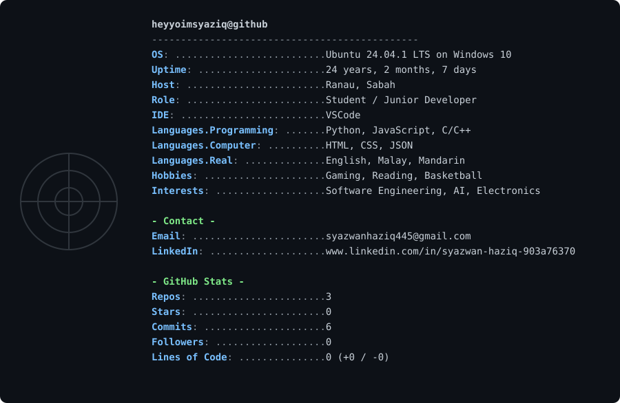

<table>
<tr>
<td>

<picture>
  <source media="(prefers-color-scheme: dark)" srcset="silhouette_dark.svg">
  <source media="(prefers-color-scheme: light)" srcset="silhouette_light.svg">
  
</picture>

</td>
<td>

<picture>
  <source media="(prefers-color-scheme: dark)" srcset="dark_mode.svg">
  <source media="(prefers-color-scheme: light)" srcset="light_mode.svg">
  
</picture>

</td>
</tr>
</table>

